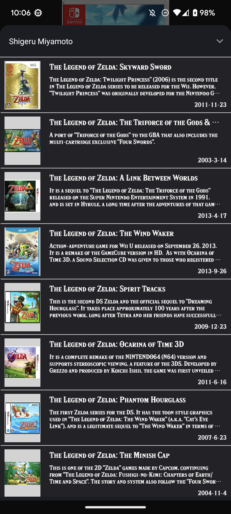

ZeldaDictionary App [Work in progress 🚧👷‍♂️]
==================

This app was designed by reading the [architecture](https://developer.android.com/topic/libraries/architecture) and [offline-first](https://developer.android.com/topic/architecture/data-layer/offline-first) learning journeys.**

This is the repository for the Dictionary of the Zelda series so far.

ZeldaDictionary is a part of functional Android app built entirely with Kotlin and Jetpack Compose(some Android View). 

# Features

ZeldaDictionary displays content from Information about the Zelda series of games and the staff involved.

## Screenshots

  

# Architecture

The **ZeldaDictionary** app follows the
[official architecture guidance](https://developer.android.com/topic/architecture) 
and [offline-first](https://developer.android.com/topic/architecture/data-layer/offline-first) .

# Build

The app contains the usual `debug` and `release` build variants. 

# UI

UI components are designed according to [Material 3 guidelines](https://m3.material.io/) and built
a some using [Jetpack Compose](https://developer.android.com/jetpack/compose). 

The app has two themes: 

- Dynamic color - uses colors based on the [user's current color theme](https://material.io/blog/announcing-material-you) (if supported)
- Default theme - uses predefined colors when dynamic color is not supported

Each theme also supports dark mode. 

# License
